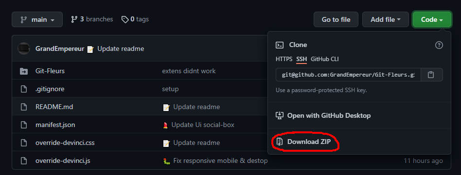
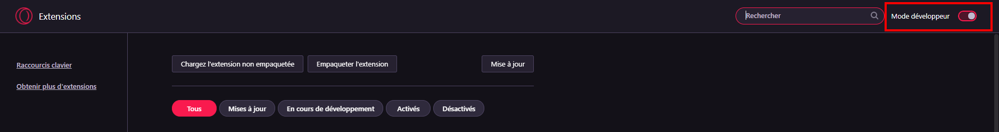
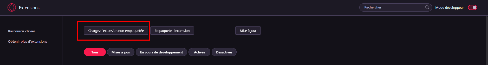

# Bienvenue sur notre projet Git-Fleurs
# About
Suite à notre cours d'initiation à de Git | Github nous avions comme projet de réaliser une extension pour navigateur qui a pour but de re-designer notre portail étudiant.

Si vous êtes un étudiant du Pôle Léonard de Vinci, vous pouvez suivre les étapes ci-dessous afin de pouvoir bénéficier d'une interface plus sympathique.
#
# Download
## 1- La première étape est de télécharger le projet comme indiqué ci-dessous. 
 

## 2- Ensuite, il vous faudra vous rendre dans votre navigateur et ajouter l'extension, puis activer le mode développeur.
 

## 3- Ensuite, il vous faudra vous rendre dans l'onglet "Charger les extensions non empaquetées."
 

## 4- Puis pour finir charger le projet en tant qu'extension.
#
## Changement
Les principaux changements se verront sur le profil, les menus et la barre d'outils de votre portail étudiant.
 
Pour cette première version, nous avons estimé que ce sont les onglets les plus visités.
 
Pour une potentielle V2, nous ajouterons d'autre fonctionnalité et d'autres refontes UI | UX

#
## Technos 
Sur ce projet nous avions dû travailler sur le CSS et le Javascript du portail :  

#
## Team
Les personnes en charge de ce projet sont :

Auriane Le Perdriel | vous retrouverez son profil en cliken sur le lien suivent --> [Github](https://github.com/aleperdriel)

Antoine Bendafi-Schulmann | vous retrouverez son profil en cliken sur le lien suivent --> [Github](https://github.com/AntoineBendafiSchulmann)

Patrick Bartosik | vous retrouverez son profil en cliken sur le lien suivent -->[Github](https://github.com/GrandEmpereur)
